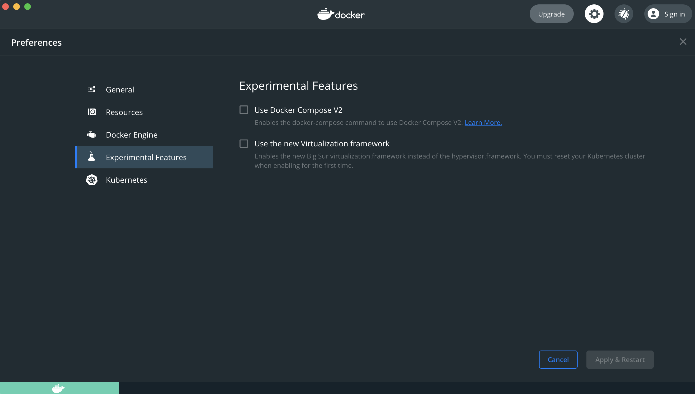
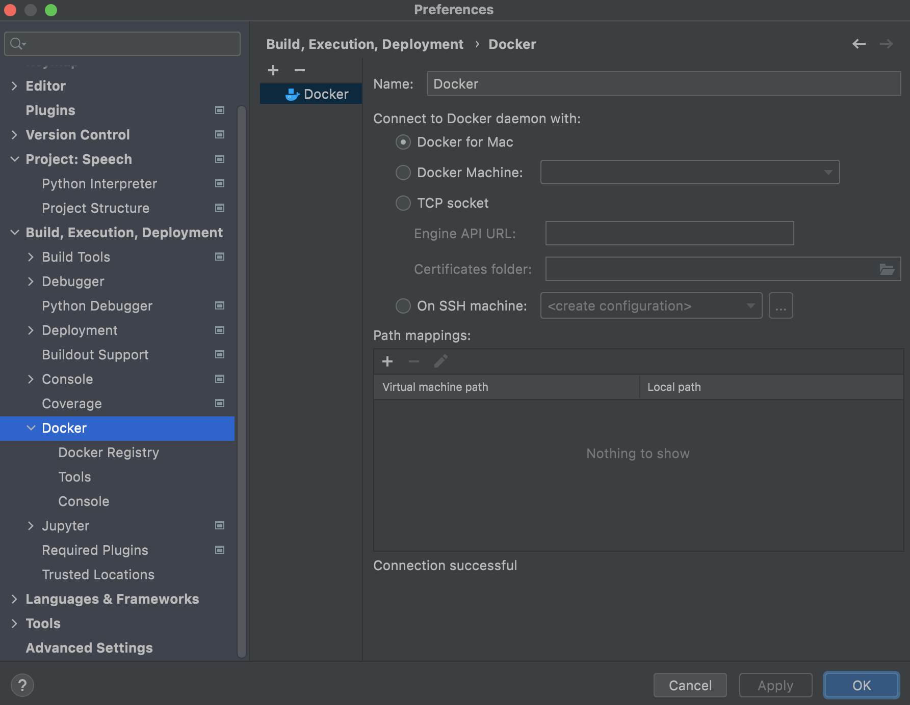
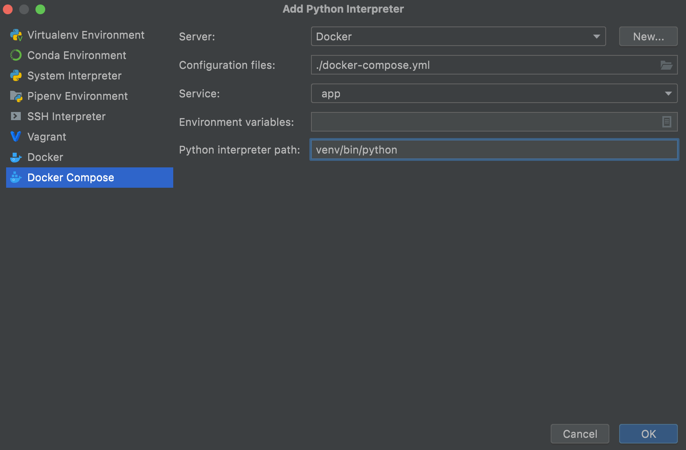
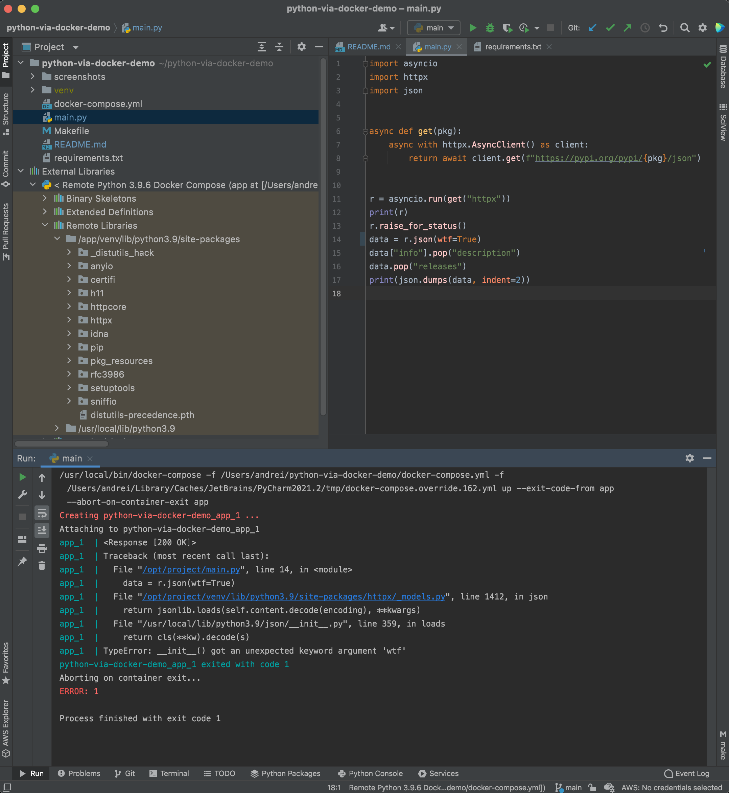

# Demo of using Docker for Python projects

When using Podman instead of Docker:
```sh
alias docker=podman
alias docker-compose=podman-compose
make podman  # mounts user home to virtual machine
```

```sh
make setup  # create venv and install requirements
make run  # run script in container

make sh  # linux shell
make py  # python shell

make clean  # remove venv and containers
```
### Make sure to use Compose V1



### Configure Python interpreter in PyCharm






